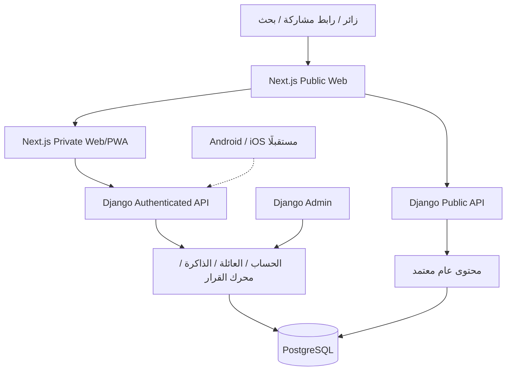

# شو نطبخ اليوم؟ — Architecture Reference

Architecture Version: 1.1  
Product Strategy: Permanent Web/PWA-first, Multi-Client Backend  
Validation Market: Kuwait  
First Scale Market: Saudi Arabia (subject to validation)  
Status: Accepted Direction — Implementation requires per-batch GO  
Last Updated: 2026-09-29

## 1. Executive Summary

**Decision Engine + Household Memory for Arab families.** المنتج مساعد لاتخاذ قرار الوجبة، يتذكر ذوق العائلة وما أكلته مؤخرًا ويساعدها تختار بسرعة. ليس Recipe App ولا AI Recipe Generator ولا «اطبخ من مخزونك» فقط. الوصفات المراجعة وسيلة لتنفيذ القرار؛ القاموس العربي الخليجي والمخزون الاختياري عوامل داعمة.

هذا الملف هو **Single Source of Truth** للمعمارية وحدود المنتج. تفاصيل ترتيب العمل في [Roadmap](../roadmap/ROADMAP.md)، وأسباب القرارات في [ADRs](../adr/ARCHITECTURE_DECISIONS.md)، والفرضيات التجارية في [Business Growth Thesis](../business/BUSINESS_GROWTH_THESIS.md)، وخطة التحقق اليدوي في [Validation Plan](../business/VALIDATION_PLAN.md). عند التعارض لا نبدأ التنفيذ؛ نراجع المرجع ونحدّث الوثائق المتأثرة بقرار واضح.

الاتجاه المعتمد: Next.js + TypeScript لواجهة Web/PWA دائمة، وDjango/DRF/Admin للخادم وإدارة المحتوى، وPostgreSQL مصدر البيانات، وخادم Modular Monolith منظم إلى وحدات داخل نظام واحد. أي Android/iOS مستقبلي يستهلك الحسابات والبيانات وواجهات الربط نفسها.

اعتماد الاتجاه وحده لا يجيز أي Batch. اعتمد المالك M00 وأعطى GO لـV00 اليدوية بتاريخ 2026-09-29 بشرط أن تكون كل العائلات بلا معرفة أو علاقة سابقة به. المشروع في مرحلة تجهيز V00؛ لم يبدأ التواصل ولم تُجز M01 أو أي برمجة.

## 2. السوق والفرضيات وبوابة البدء

**Kuwait-first Validation → Saudi-first Scale.** وجود المؤسس في الكويت يسهّل المقابلات والدعم وفهم السياق. V00 تبدأ يدويًا مع 15–20 عائلة في الكويت. تجربة البرنامج المغلقة لاحقًا تشمل 20–50 عائلة في الكويت من رابط مباشر. السعودية أول سوق توسع بالحجم بعد إثبات الاستخدام والعودة وتحقيق سعودي مناسب للمحتوى واللغة والقنوات؛ لا تعمم نتائج الكويت تلقائيًا.

الترتيب: M00 توثيق واعتماد النطاق → V00 Demand Validation Sprint → Decision Gate GO/MODIFY/STOP → M01 فقط عند GO، ثم موافقة مستقلة لكل دفعة. GO للانتقال من التحقق لا يجيز تنفيذ كل المراحل دفعة واحدة.

المشكلة المتكررة، الاحتفاظ بالعائلات، جودة القرار، قنوات الاكتساب والاستعداد للدفع فرضيات. **CAC = Unknown until measured.** لا نسب نجاح متوقعة أو break-even ثابت أو valuation/equity أو مدة مشتقة من عدد الدفعات. أهداف القياس في خطة التحقق قواعد قرار داخلية تُراجع، وليست حقائق سوقية.

## 3. نطاق MVP ورحلة القيمة

بالغ واحد يدير عائلة واحدة. ندعم العربية وRTL ومصطلحات الكويت والسعودية والإمارات، دون لغات إضافية أو حسابات أفراد ودعوات. الإعداد يجمع عدد الأشخاص، البلد والتفضيلات والقيود الضرورية بأقل إدخال.

الرحلة الأساسية: دخول → إعداد عائلة مختصر → شاشة اليوم → وقت متاح وفئة ميزانية وماذا لا نريد اليوم → حتى ثلاثة خيارات → تفاصيل وحصص → وضع الطبخ → «طبخناها اليوم» وتقييم اختياري. يمكن الوصول للاقتراحات دون مكوّن واحد في Pantry. لا نصنف pantry=empty خطأ أو إعدادًا ناقصًا ولا نفرض خطوة تعبئتها. تاريخ الوجبات غير الموجود لأول مستخدم حالة طبيعية أيضًا.

الاقتراحات: الأفضل لك / الأسرع / الأوفر ضمن فئة تكلفة تقديرية، من وصفات معتمدة ومن قواعد خادمية. لا نفرض ثلاث نتائج إن لم توجد خيارات آمنة مختلفة. المفضلة والتاريخ وتقليل التكرار تشكل ذاكرة العائلة. لوحة Django بسيطة تكفي لإدارة المحتوى.

المستبعد من MVP: Vision وتصوير الثلاجة، barcode، expiry، تخطيط أسبوعي متقدم، مشتريات متقدمة، سوبرماركت وأسعار حية، مجتمع ومشاركة وصفات بين المستخدمين، استيراد TikTok/Instagram، nutrition tracker كامل، voice، حسابات عائلية متعددة، native Android/iOS، لغات إضافية، ML متقدم، vector DB وElasticsearch وmicroservices وKubernetes، offline sync معقد، اشتراكات وإعلانات وإشعارات، إنشاء وصفات بحرية بالـAI وتعدد مزودي AI. مشاركة رابط وصفة عامة من فريق المحتوى مسموحة؛ نشر وصفات المستخدمين غير مشمول.

## 4. Permanent Web/PWA-first وMulti-client Architecture

الويب قناة دائمة للوصول والمشاركة والبحث والتسجيل والاستخدام. PWA تحسين اختياري للتثبيت والقراءة المحلية وليست بوابة إجبارية. Android وiPhone يستخدمان المتصفح أولًا؛ إطلاق Native لا يلغي الويب.

Django مصدر الحقيقة؛ Next.js لا يصل إلى DB مباشرة. الوحدات تتشارك قاعدة واحدة ومعاملات واضحة. لا مخزون أو توصيات أو اشتراك منفصل لكل منصة. عند دخول Native مستقبلًا بنفس الحساب يجد نفس العائلة؛ يحتاج إثبات دخول مستقل ولا نفترض نقل Cookie من المتصفح.

مسؤولية Next.js: العرض والتنقل وRTL والنماذج والتحقق الأولي وSEO والاتصال بالـAPI والقراءة المحلية وإدارة التحديث. مسؤولية Django: التحقق النهائي، الملكية والصلاحيات، الحصص، الحساسية، مطابقة المكونات، التوصيات، التاريخ وإدارة الإصدارات. لا منطق أعمال حرج مكرر في الواجهة؛ offline يعرض نتيجة محفوظة بحصصها ولا يعيد حسابها.

## 5. Public Web مقابل Private Logged-in App

تطبيق Next.js واحد، مع فصل منطقي ومسارات وسياسات بيانات واضحة:

| المسار المقترح | الغرض | السياسة |
|---|---|---|
| / | تعريف ودعوة لتجربة المنتج | عام |
| /recipes/{slug} | وصفة اختار الفريق نشرها | Public API فقط |
| /r/{slug} | تحويل إلى رابط الوصفة الأساسي | دون أي بيانات عائلة |
| /privacy، /terms، /help | معلومات ومساعدة | عام |
| /app/today، /app/pantry | القرار والمخزون الاختياري | جلسة وصلاحية خادمية |
| /app/favorites، /app/history | ذاكرة العائلة | خاص |
| /app/recipes/{id}، /app/cook/{id} | تفاصيل وطبخ | خاص |
| /app/settings وصفحات الدخول والاستعادة | إدارة الحساب | غير مفهرس |
| /app/offline | واجهة قراءة محلية | shell عامة خالية من بيانات الحساب |

النشر داخل التطبيق لا يجعل الوصفة عامة. Public API يستخدم قائمة حقول مسموحة، دون مسودات أو ملاحظات مراجعين أو بيانات عائلة. صفحة عامة لا تمرر Cookie المستخدم لطلب المحتوى العام. طلب بيانات خاصة دون جلسة يرفضه الخادم حتى إن أمكن فتح هيكل الصفحة.

الصفحات الخاصة noindex وخارج Sitemap، وبيانات الحساب private, no-store عبر Next.js وRSC وAPI وCDN. robots.txt ليس حماية وصول. معاينات مشاركة الصفحات الخاصة عامة ومحايدة؛ لا اسم أسرة أو مخزون أو قيود في URL أو metadata. صلاحية Closed Beta تفرض على الخادم.

## 6. Authentication وAuthorization

جلسات Django المعتادة عبر **Secure HttpOnly web session cookies + CSRF**. إعداد SameSite=Lax مبدئي، عمر جلسة محدد، HTTPS وإعادة تحقق للعمليات الحساسة. لا JWT في localStorage أو IndexedDB ولا refresh-token ledger مخصص في MVP.

يفضل أصل واحد: Next.js للصفحات، Django تحت /api/v1 و/admin عبر توجيه أمامي. يمنع ذلك تعقيدًا غير ضروري في Cookie وCORS. تبقى Django خدمة مستقلة عن Next.js. CSRF على الدخول والطلبات المجهولة التي تغيّر الحالة وعلى كل كتابة؛ الخروج POST. لا يكفي افتراض DRF SessionAuthentication لحماية نموذج الدخول المجهول.

تستخدم مكتبات مجربة للتحقق والاستعادة وكلمات المرور. الروابط محدودة العمر والاستخدام، ورسائل لا تكشف وجود بريد مسجل، وضبط معدلات محاولات الدخول والاستعادة. redirect بعد الدخول إلى مسار داخلي معتمد فقط. تعطيل الحساب يلغي الوصول والجلسات؛ الأخطاء لها رموز واضحة مستقلة عن افتراض كود HTTP واحد لكل رفض.

كل استعلام خاص يقيّد بالمالك؛ household_id المرسل ليس دليل ملكية. الإدارة منفصلة بصلاحيات محدودة وحماية قوية وسجل تغيير. Native لاحقًا يضيف token flow مجربًا مع تخزين آمن للنظام وإلغاء/تدوير مناسب، فوق نفس users وصلاحيات الأعمال؛ لا ينفذ الآن.

## 7. نموذج البيانات وحدود الوحدات

الأسماء التالية تصميم مقترح وليس migrations أو schema نهائيًا. يحسم كل Mini-Contract الحقول والفهارس والقيود اللازمة.

| الوحدة | البيانات والعلاقات الأساسية |
|---|---|
| identity | مستخدم بالغ، جلسات المكتبة، تحقق واستعادة، أهلية Beta |
| households | مالك فريد وعائلة واحدة، بلد ومنطقة زمنية وحصص وتفضيلات وقيود |
| ingredients | ingredient ثابت، aliases إقليمية، units، علاقات حساسية/تصنيف مع مصدر مراجعة |
| recipes | هوية وصفة ثابتة، recipe_versions، مقادير وخطوات ووقت وحصص وصورة وحقوق ومصدر |
| publishing | اعتماد وسحب ونسخة منشورة، is_public=false افتراضيًا، public_slug فريد وسجل مراجعة |
| pantry | household + ingredient فريد، موجود/غير موجود، كمية ووحدة اختياريتان، revision |
| favorites | علاقة العائلة بهوية الوصفة مع منع التكرار |
| meal_history | حدث طبخ بتاريخ العائلة ونسخة الوصفة والحصص وتقييم اختياري ومعرّف عملية |
| recommendations | جلسة، إصدار القواعد، نسخ المحتوى، سياق مختصر، items وأسباب وfeedback |
| analytics | أحداث محددة بإصدارها ومعرّفات تجنّب التكرار وسياق العميل |
| privacy/operations | طلبات حذف/تصدير وحالاتها وأثر إداري محدود |

PostgreSQL يدعم العلاقات والمعاملات والفهارس المبنية على القياس. لا vector DB أو Elasticsearch. البحث العربي المحدود يبدأ بأسماء وأسماء بديلة مطبّعة داخل النظام. لا نخزن جداول AI أو دفع أو native token مستقبلية بلا استخدام معتمد.

تاريخ الخادم UTC ويعرض وفق منطقة العائلة؛ معنى «اليوم» يحسب وفقها. إعادة طلب الكتابة لا تنشئ طبخًا مضاعفًا؛ idempotency key يميز المحاولة المكررة عن وجبتين حقيقيتين. تحديثات المخزون تستخدم revision أو تحققًا مكافئًا لرفض الكتابة القديمة بدل مسح تعديل أحدث بصمت.

## 8. API وعقود العملاء

REST JSON تحت /api/v1. OpenAPI وعقود الأحداث ستنشأ في دفعاتها؛ `docs/contracts` يحتوي سجل مراجعة M00 وMini-Contract لـV00 فقط، ولا يحتوي عقد تنفيذ برمجي. تستقل العقود عن شكل React أو Flutter. الأخطاء منظمة، والـpagination والحدود والصلاحيات والتحقق من المدخلات توثق لكل endpoint.

المجموعات المتوقعة: auth/csrf وregister/login/logout/session والتحقق والاستعادة؛ household/preferences؛ ingredients/search/resolve؛ recipes/details/servings؛ pantry؛ favorites؛ meal-history؛ recommendations/generate/read/feedback؛ public/recipes وpublic/sitemap-entries؛ analytics/events؛ client-config غير السري؛ privacy/export/delete/status.

السياق المشترك للتوصية: household preferences/constraints، servings، time، budget_class، dislikes_today، meal_history، وربما مكونات اختار المستخدم إعطاءها أو pantry المعروفة. غياب pantry لا يفشل العقد ولا يُحوّل الطلب إلى no-results. null/غير معلوم يختلف عن تصريح «غير موجود».

بعد الكتابة، تأكيد الخادم هو المرجع. عند فتح الشاشة أو العودة إليها يجلب العميل أحدث البيانات. لا WebSocket أو مزامنة موزعة في MVP. تغييرات API تبقى متوافقة فترة معلنة مع إصدار الويب السابق؛ التغييرات الكاسرة تحتاج إصدارًا وخطة انتقال. session/rules/recipe/client/local_schema إصدارات مستقلة.

## 9. Household وOptional Pantry

واحد بالغ/واحد household في MVP؛ لا أسماء أطفال أو ملفات صحية تفصيلية. نفصل الحساسية والممنوعات الصلبة عن الذوق المرن، وعن «لا نريد اليوم» المؤقت. نطلب الحد الأدنى الضروري ونسمح بتعديل إعدادات العائلة بالاتصال.

Pantry مساعدة اختيارية. موجود/غير موجود مع كمية اختيارية؛ unknown ليس صفرًا. لا نجزم بكفاية مكوّن من مجرد وجوده إذا لم تُعطَ كمية. عند غياب القائمة تعرض الوصفة قائمة احتياجاتها بصيغة محايدة دون ادعاء أن كل شيء ناقص. الإدخال اختياري في onboarding وToday ولا يمنع الانتقال. لا خصم آلي بعد الطبخ ولا صلاحية أو باركود أو تذكير تحديث.

ملاءمة المخزون إشارة ترتيب إضافية فقط عند توفر بيانات صالحة، ولا تتحول إلى قيد أهلية افتراضي أو عقوبة على عائلة لم تعبئه. يجب قياس هل تريد العائلات المحافظة عليه أصلًا؛ استخدام المنتج دون Pantry رحلة قبول أساسية.

## 10. Recipe Versioning وسلامة المحتوى

recipe هوية دائمة، وrecipe_version لقطة للمقادير والخطوات والحصص والوقت والمصدر والتصنيفات. المسار: draft → review → approved/published؛ withdrawal مسار مستقل عند مشكلة. النسخ المعتمدة لا تعدل في مكانها؛ ينتج التصحيح نسخة جديدة ويحفظ التاريخ مرجع النسخة التي استعملها.

المراجعة تشمل قابلية الطبخ، المقادير والوحدات، الخطوات، الحساسية، الحدود المقبولة للتحجيم، حقوق النص والصورة، الزمن وفئة الميزانية. الحصص تحسب في Django؛ لا ضرب آلي لوقت الطهي أو تحويل حجم إلى وزن دون قاعدة موثقة. المكونات الاختيارية والبدائل المعتمدة لها قواعد حساسية واضحة؛ لا اقتراح بديل حر من نموذج لغوي.

المسودة لا تدخل التوصيات. اعتماد الوصفة خاص بالتطبيق؛ النشر العام قرار منفصل. السحب يمنع توصيات وقراءات جديدة على الاتصال ويعطّل العرض المحلي بعد وصول إشارة السحب. أثناء انقطاع الإنترنت لا يمكن ضمان معرفة سحب حدث للتو؛ تظهر نسخة وتاريخ آخر تحقق وتحذير واضح بأن البيانات قديمة. تحديث السلامة عند الاتصال لا يستبدل مقادير جلسة الطبخ بصمت؛ يوقف الاعتماد على النسخة المسحوبة ويوضح الحاجة لمراجعتها.

محتوى Beta هدفه تغطية سيناريوهات حقيقية؛ نطاق 100–150 وصفة تخطيطي وليس شرط نجاح بحد ذاته. تنشر حزم 5–10 وصفات بعد مراجعة، وتكفي 5–10 عامة كبداية SEO. حقوق المحتوى ووقت مراجعته تكلفة بشرية مستقلة.

## 11. Arabic Food Ontology

قاموس سياقي يربط الاسم العام بمعرّف مكوّن ثابت ويحتفظ بمرادفات الكويت والسعودية والإمارات والسياق. «لبن/روب» يحتاجان تحديد معنى حسب البلد والاستخدام؛ «طماطم» لا تساوي «معجون طماطم». التطبيع يساعد البحث ولا يدمج المكونات اعتباطيًا.

الـontology تشمل الشكل والحالة والوحدة والعائلة الغذائية والحساسية والعلاقات المراجعة. البديل علاقة محددة للسياق وليس synonym. الاختلاف الملتبس يعيد خيارات للمستخدم. الاختيار والحفظ بمعرّف ثابت مع تسمية محلية في العرض. البداية قاموس صغير محرر يدويًا واختبارات أمثلة خليجية، دون AI parsing أو استنتاج سلامة من تشابه لغوي.

## 12. Deterministic Recommendation Engine

ينفذ على الخادم، دون LLM لكل طلب، ويفصل أهلية الوصفة عن ترتيبها:

1. يبني سياق العائلة والطلب من مصدر موثوق مع defaults معلنة؛ pantry فارغة مسار طبيعي.
2. يأخذ نسخًا معتمدة غير مسحوبة وقابلة للتحجيم للحصص المطلوبة.
3. يطبق القيود الصلبة: الحساسية والممنوعات وحد الوقت/الميزانية إذا صرح المستخدم أنها إلزامية و«لا نريد اليوم» الصريح. لا تُخفف القيود الصحية لتحسين عدد النتائج. السياسات التفصيلية للوقت والميزانية تحسم في M18.
4. يرتب حسب ملاءمة الذوق، الوقت، فئة الميزانية، تاريخ الطبخ وتقليل التكرار. يضيف ملاءمة المكونات عند معرفتها فقط؛ لا حاجة لأي عنصر Pantry كي يعمل.
5. يختار حتى ثلاث وصفات مختلفة: الأفضل / الأسرع / الأوفر ضمن معلومات تقريبية. التعادل يحسم بمفتاح ثابت؛ لا تكرار بطاقة لملء العدد.
6. يعيد أسبابًا صادقة وrecipe_version وrules_version وسياقًا كافيًا للتتبع دون جمع مفرط.

نفس المدخلات ونفس نسخ القواعد/المحتوى/التاريخ والزمن المرجعي تنتج نفس النتيجة. الوقت وتاريخ العائلة مدخلان صريحان لا عشوائية خفية. أوزان الترتيب وثوابت تقليل التكرار تضبط باختبارات وقبول المنتج، ولا تعرض الآن كقيم مثبتة.

budget classes: اقتصادي/متوسط/مرتفع، تصنيف تحريري نسبي للسوق، ليس سعر متجر أو وعد توفير مالي. إذا غابت بيانات الكلفة لا نختلق رقمًا. لا تقارن أسرًا بأسعار أو دخل حساس.

صفر نتائج يعرض السبب وخيارات تغيير مرنة مثل وقت أكبر أو استبعاد ذوق أقل، دون اقتراح تخفيف حساسية. لا AI fallback. التغطية والمخرجات تقاسان مع Pantry وبدونها. جودة القرار تشمل الوقت للاختيار ونسبة الخروج دون قرار، لا عدد البطاقات فقط.

## 13. Household Memory وFavorites/History

المفضلة إشارة إعجاب قابلة للإلغاء وليست دليل طبخ. فتح التفاصيل أو إنهاء خطوات Cook Mode ليس إثبات أن العائلة طبخت؛ «طبخناها اليوم» تصريح منفصل على اتصال. يمكن تصحيح التاريخ أو حذف الحدث، ويقل أثر السجل القديم وفق قواعد معلنة.

Meal history يربط النسخة والحصص وتاريخ الطبخ والتقييم الاختياري. تقليل التكرار والتنوع عقوبات ترتيب مرنة ما لم يطلب المستخدم استبعادًا صريحًا. لا ML متقدم ولا تعلم قوي من كل نقرة. لا نضاعف الطبخ بسبب retry ولا نمنع وجبتين حقيقيتين في يوم واحد.

## 14. PWA: Manifest وService Worker

واجهة Mobile-first عربية: RTL، لمس، تكبير نص، قارئ شاشة، تركيز ولوحة مفاتيح، safe areas، رسائل شبكة واضحة. التثبيت اختياري؛ الرحلة كاملة في تبويب عادي. تعليمات إضافة الشاشة الرئيسية حسب المتصفح، وفتح المتصفح الرئيسي إن كان المتصفح الداخلي لا يدعم القدرة المطلوبة.

Manifest: اسم/اسم مختصر، lang=ar وdir=rtl، هوية ثابتة، start_url وscope داخل /app/، display=standalone عند الدعم، ألوان وأيقونات مناسبة. لا account ID أو حملة متغيرة في الهوية. دعم التثبيت والتخزين يختلف؛ يتحقق على أجهزة فعلية وقت التنفيذ.

Service Worker محدود إلى /app/، مع قائمة حفظ مسموحة صريحة. نطاقه وحده لا يمنع تخزين طلبات API الخاصة. يدير shell وoffline fallback وملفات العرض والتحديث؛ لا يحسب توصيات ولا يدير outbox أو يرسل كتابة لاحقًا. نسخة shell المحفوظة عامة وخالية من بيانات العائلة؛ لا تخزين تلقائي لـHTML/RSC خاص.

## 15. Offline Reads والتقدم المحلي

| البيانات/العملية | التخزين والسلوك |
|---|---|
| shell وملفات ثابتة ذات إصدار | Cache Storage، ملفات عامة |
| وصفة منزلة بحصص محددة | IndexedDB، نسخة وتاريخ تحقق ومالك محلي |
| صور اكتمل تنزيلها | Cache Storage، مفاتيح وحقوق وحدود واضحة |
| Cook Mode وتقدم الخطوات | IndexedDB، محلي فقط وليس سجل طبخ خادمي |
| آخر المفضلة | لقطة محدودة للقراءة مرتبطة بالحساب |
| الاقتراحات السابقة | عنوان/وقت/نسخة، وسم «اقتراح سابق» ووقت التوليد؛ دون قيود صحية |
| المخزون والحساسيات | لا نسخة offline في MVP |
| بيانات الدخول | لا localStorage ولا IndexedDB؛ Cookie جلسة آمنة |

**Online required:** توصيات جديدة، تغيير الحصص غير المنزلة، تعديل العائلة/المخزون/المفضلة، تسجيل الطبخ، دخول واستعادة وحذف وتصدير. لا queue لكتابات مؤجلة ولا وعد حفظ دون رد الخادم. التقدم المحلي في الطبخ استثناء محلي واضح؛ لا يزامن أحداثًا تجارية ولا يتحول تلقائيًا إلى cooked today.

ينزل النص كاملًا قبل إعلان الجاهزية؛ فشل الصورة يوضح ولا يمنع قراءة النص. سقف أولي تخطيطي مثل 20 وصفة أو 50MB يضبط بالاختبار، مع حذف اختياري وسياسة إخلاء. تخزين المتصفح قابل للفقد وليس backup. أول زيارة بلا شبكة تعرض fallback إن سبق توفر shell، وإلا لا يمكن ضمان تحميل تطبيق لم يزر قط. رفض التخزين يبقي تجربة online.

يعزل التخزين لكل حساب ويمسح عند logout أو تبديله، وتبلغ التبويبات الأخرى. epoch/session generation يمنع طلبًا قديمًا عاد بعد logout من إعادة تعبئة بيانات المالك السابق. لا نخزن أسرارًا، ولا نستعمل معرف التخزين لإثبات صلاحية. جهاز مشترك قد يتيح قراءة النسخ المحفوظة لمن يستخدم نفس المتصفح؛ توضح ميزة التنزيل والحذف ذلك.

إبطال جلسة الخادم يحتاج اتصالًا؛ مسح محلي offline ليس خروجًا خادميًا. لا تعرض نسخة مخبأة بدل 401/403 أو استجابة سحب محتوى؛ fallback فقط لفشل الشبكة وفق السياسة. حذف الحساب من جهاز آخر لا يستطيع محو جهاز مفصول فورًا؛ يمسح عند الاتصال والتحقق التالي.

## 16. Safe Updates وVersion Invalidation

ثلاثة إصدارات منفصلة: web_release، local_schema_version، recipe_version/safety status. يمكن إضافة API/rules version دون خلطها. تحديث الواجهة لا يمحو تقدم الطبخ، وتغيير وصفة لا يبدل مكوناتها أثناء الجلسة بصمت.

Service Worker الجديد ينتظر؛ تعرض الواجهة تحديثًا جاهزًا. يؤجل reload أثناء الطبخ، مع حفظ التقدم وخيار انتقال واضح. لا skipWaiting قسري عام ولا حذف ملفات يحتاجها تبويب مفتوح. تُختبر ترقية IndexedDB على بيانات فعلية؛ عند عدم التوافق تعزل اللقطة غير القابلة للقراءة وتوضح إعادة التنزيل، ولا تعرض بيانات مجهولة البنية.

ملفات ثابتة بأسماء مرتبطة بالإصدار، وملف العامل يعاد التحقق منه دون TTL طويل يمنع التحديث. نشر API يتوافق مؤقتًا مع العميل السابق؛ rollback يختبر على عميل قديم وحالة محلية قديمة. إبطال الوصفة يؤثر على API والعرض العام والتنزيل عند الاتصال؛ cache عام مستقبلي يتطلب مسار purge مثبتًا.

اختبارات إلزامية: تبويبان بإصدارين، تنزيل أثناء نشر، إغلاق أثناء طبخ، فقد مساحة، تغيير حساب مع طلب متأخر، وصفة مسحوبة، فشل ترقية وتراجع نشر. التحديث الأمني العاجل له قرار واضح ورسالة للمستخدم وحفظ تقدم حيث يمكن؛ لا وعد بإبقاء عميل غير آمن متصلًا.

## 17. SEO وSharing الدائمان

قالب عام قابل للقراءة من HTML الخادم، عناوين ووصف وروابط ثابتة، canonical وSitemap للمنشور فقط، Open Graph وصور مرخصة وبيانات Recipe منظمة عند وجود حقولها فعليًا. لا تقييمات أو nutrition أو أزمنة مختلقة. لا ضمان لترتيب أو ظهور مميز في البحث.

مجموعة عامة صغيرة مراجعة؛ لا آلاف صفحات ضعيفة أو حسابات مفهرسة. MVP يفضل قراءة حديثة للمحتوى العام دون cache مشترك طويل؛ الصور والملفات ثابتة بسياسة منفصلة. أي cache لاحق مشروط باختبار السحب والإبطال. إزالة المصدر لا تمحو فورًا معاينات منصات المشاركة الخارجية.

مشاركة وصفة عامة فقط، Web Share عند الدعم وإلا نسخ الرابط. لا household_id أو session أو pantry أو سبب صحي في الرابط. قياس share_started لا يعني إرسالًا ناجحًا أو اكتسابًا. الروابط الخاصة والتواصل الاجتماعي للمستخدمين مؤجلان.

## 18. Analytics Multi-client

أحداث بسيطة first-party: إعداد اكتمل، طلب توصية، ظهرت نتائج/لا نتائج، اختيار وجبة، بدء طبخ، تسجيل طبخ، مفضلة، بدء مشاركة، خطأ تنزيل/تحديث. مخطط allowlist مع event_id وإصدار الحدث ووقت حدوثه واستلامه وclient_platform وclient_version وdisplay_mode ومعرف جلسة توصية عند الحاجة.

web/pwa يصفان طريقة العرض الحالية ولا يكشفان سجل تثبيت موثوقًا. android/ios قيم مستقبلية للعقد، دون SDK أو تطبيق الآن. الحساب نفسه فريد في إجمالي النشطين؛ مجموع المنصات قد يتجاوز الإجمالي. لا بصمة جهاز أو ربط مجهول قسري.

مصدر إحالة مختصر وUTM مسموح دون URL كامل أو بريد أو token؛ لا مخزون أو حساسية أو نص شخصي في events. مدد الاحتفاظ والحذف وتفاصيل الموافقة تعتمد قبل بيانات حقيقية. لا استنتاج طبخ من tap ولا backfill خفي لكتابات offline. يقاس ما وصل فعلًا وتوضح فجوات القياس.

قمع القياس: مدعو → وافق → جرّب → طلب → اختار → صرح بطبخ → عاد في أسبوع لاحق. تظهر الأعداد والمقامات وفترة نضج cohort. D1/D7/D30 أو W2/W4 لا تحسب قبل مرور النافذة. time-to-decision مع abandoned sessions؛ retention للعائلة لا للجلسة. CAC Unknown until measured مع تكلفة القناة الفعلية وتعريف العائلة المفعلة؛ زيارات SEO ليست retention.

## 19. Privacy وSecurity

تقليل البيانات، فصل العام والخاص، TLS، إدارة أسرار خارج المصدر، أقل صلاحيات للإدارة والخدمات، تحقق المدخلات وrate limits، منع CSRF/XSS وIDOR، سجل أحداث تشغيل دون كلمات مرور أو رموز أو بيانات حساسة. المنع الصحي لا يعني ضمانًا طبيًا؛ المحتوى المراجع لا يلغي مسؤولية التحقق من المنتجات ومكوناتها.

حذف/تصدير مع إعادة تحقق وحالة واضحة وتقييد رابط التصدير بعمر وصلاحية؛ لا روابط عامة دائمة. الحذف يعطّل الحساب والجلسات أولًا ويتبعه إزالة البيانات وفق سياسة معتمدة. Backup له احتفاظ محدود؛ عند restore تطبق سجلات الحذف لمنع إحياء حساب محذوف. لا وعد محو فوري لكل نسخة احتياطية أو جهاز offline.

قبل V00 موافقة بسيطة وبيانات قليلة وأكواد عائلات؛ قبل Beta مراجعة ملائمة للكويت ومكان الاستضافة والمزودين والاحتفاظ ونقل البيانات، وقبل السعودية مراجعة مستقلة. هذا شرط عمل مستقبلي، لا ادعاء امتثال قانوني جاهز ولا فتح خدمة الآن.

## 20. AI وMonetization Boundaries

MVP بلا Live AI Chef أو AI API أو إنشاء وصفات حر. قد يدرس AI Chef بعد ثبوت حاجة وبعقد منفصل: مزود واحد، server-side فقط، سياق محدود، محتوى معتمد، مخرجات مقيدة تُتحقق، سقف تكلفة ومعدل ووقت، سجل تكلفة بلا بيانات حساسة وfallback آمن. لا يتجاوز الحساسية أو ينشر وصفات غير مراجعة.

Premium، weekly planning، AI Chef، grocery/affiliate، sponsored content الواضح وads عند scale فرضيات ربح مستقبلية فقط. لا جداول أو حسابات أو دفع أو إعلانات في MVP. إذا اعتمد الدفع لاحقًا، entitlements خادمية موحدة مستقلة عن مصدر الشراء؛ تحقق webhooks والاسترداد والتكرار وسياسات المتجر وقتها. الرعاية لا تتجاوز قيود السلامة ولا تخفى داخل ترتيب يدعي الحياد.

## 21. Infrastructure وDeployment وCost Control

تصور مستقبلي: نطاق وHTTPS، تشغيل Next.js وDjango كخدمتين خلف أصل واحد، PostgreSQL، صور وبريد ومراقبة ونسخ احتياطية. يمكن جهاز مناسب للخدمتين مع DB مدارة أو منصة مدارة؛ الاختيار والمنطقة والعرض الفعلي قبل التعاقد. لا ملفات deployment أو حسابات في إعداد الوثائق.

Development ثم بيئة اختبار معزولة ثم إنتاج. أسرار منفصلة، لا بيانات أسر حقيقية في local fixtures، migration خطة عودة وbackup، health/readiness دون أسرار. logs وrequest IDs ومقاييس latency/errors/DB وبريد ومراقبة فاتورة. لا general jobs framework أو Celery/Redis مبكر؛ أوامر إدارية مجدولة للحذف والتنظيف والنسخ عند الحاجة مع idempotency ومراقبة فشل.

نحدد RPO/RTO، أي خسارة بيانات وزمن استعادة مقبولين، قبل Beta ونثبتها بتجربة restore فعلية؛ لا نكتب ضمان توافر بلا دليل. صور مضغوطة وحدود حجم، pagination وفهارس ومراقبة استعلامات. لا CDN لبيانات الحساب أو caching خفي في طبقة Next.js.

**Software cash cost** منفصل عن **Business launch cost**. برمجة المؤسس وCodex قد تكون منخفضة نقديًا دون احتساب الوقت والأدوات. لا تفترض ضرورة مبلغ $3,000–8,000 للبرمجيات. نطاقات تشغيل تخطيطية بالدولار/الشهر، وليست عروض مزود: local 0–10، اختبار داخلي 30–90، Beta 40–130، إطلاق صغير 75–220؛ سقف مقترح للـBeta 150 يحتاج اعتمادًا وتحقق سعر قبل شراء.

قد تكون كلفة المحتوى وسلامة الطعام والصور/الحقوق والخصوصية/القانون والتسويق والبحث والدعم والأجهزة أعلى من البرمجة النقدية. النطاق وتجديده والضرائب وأدوات المؤسس بنود مستقلة؛ لا عد مزدوج لخدمة تجمع DB/backup. تنبيهات وحدود للصور والطلبات والبريد والفاتورة، ولا AI أو متاجر في ميزانية MVP. الأرقام تخطيطية غير مثبتة حاليًا.

## 22. Testing وScalability وFuture Native

الاختبارات حسب الدفعة: unit للقواعد والحصص والـontology، integration لقيود DB والصلاحيات/CSRF/idempotency، contract للعقود العامة والخاصة، end-to-end للرحلة العربية مع وبدون Pantry، واختبار وصول وoffline وتحديث وفصل حسابات. مجموعة regression تراكمية تغطي الصفر/واحد/ثلاثة اقتراحات والقيود والسحب والتكرار.

UI Smoke على Chrome Android وSafari iPhone ومتصفح مكتبي، online وstandalone وبشبكة ضعيفة؛ WebKit آلي لا يغني عن iPhone فعلي. يختبر restore وrollback والنشر على PWA قديمة. لا نكتب اختبارات أو كود الآن.

نقيس الاختناق قبل التوسع: تحسين الاستعلامات والفهارس والحمولات والصور ثم زيادة موارد، ثم cache آمن عند الحاجة. queue أو خدمات منفصلة لا تأتي إلا من حاجة موثقة وحدود تشغيل. لا Kubernetes أو microservices استباقية.

Native قرار مبني على عائق أو طلب متكرر لا يعالجه الويب، وكلفة دعم قابلة للتحمل. Flutter مرشح يعاد تقييمه عند N01/N02 وليس التزام تنفيذ الآن. يعاد استخدام backend/API/accounts/data/analytics/entitlements؛ واجهات React لا تنتقل تلقائيًا، وكلفة UI واختبارات ومتاجر مستقلة. Google Play وApple والتوقيع ليست في مسار MVP.

## 23. حدود التنظيم وسير العمل

الهيكل البرمجي المستقبلي المقترح فقط: apps/web للعرض، services/backend/modules لوحدات الأعمال، content للمحتوى المراجع، عقود API/events حسب دفعاتها، infra/runbooks حين تعتمد. لا تنشأ هذه المجلدات الآن. الموجود حاليًا وثائق Markdown، ومنها سجل مراجعة M00 وعقد V00 اليدوي داخل `docs/contracts`؛ لا يوجد عقد برمجي.

كل دفعة تتبع:

Architecture Review / review of current state → Decisions → Mini-Contract → explicit GO → Implementation → Targeted Tests → Affected Tests → Full Regression → UI Smoke → Final Diff Review → Commit Approval → Commit

Mini-Contract يحدد الهدف والنطاق والاستثناءات والملفات والبيانات والعقود والفحوص والكلفة وشروط التوقف. GO محدد للدفعة وCommit Approval موافقة مستقلة. لا تخطّي اختبارات مستحقة، ولا توسيع نطاق تلقائي عند اكتشاف عمل جديد.

لا مدة مستنتجة من 32 Batch؛ تعاير السرعة بعد أول 3–5 دفعات تنفيذية فعلية بعد البوابة. مراجعة المحتوى والبحث والاختبار الحقيقي والقانون/الخصوصية وClosed Beta وقت بشري مستقل، وقد يصبح المسار الحرج حتى لو انتهى الكود.

## Change Log

- v1.1 — Switched from Flutter Android-first to permanent Web/PWA-first multi-client architecture. Native Android/iOS deferred until validated by product evidence.
- v1.1 clarification — 2026-09-29: Kuwait-first Validation → Saudi-first Scale (subject to separate validation); V00 manual Demand Validation Sprint and GO/MODIFY/STOP gate before M01; optional Pantry; Decision Engine + Household Memory positioning; business hypotheses documented without unmeasured benchmarks.
